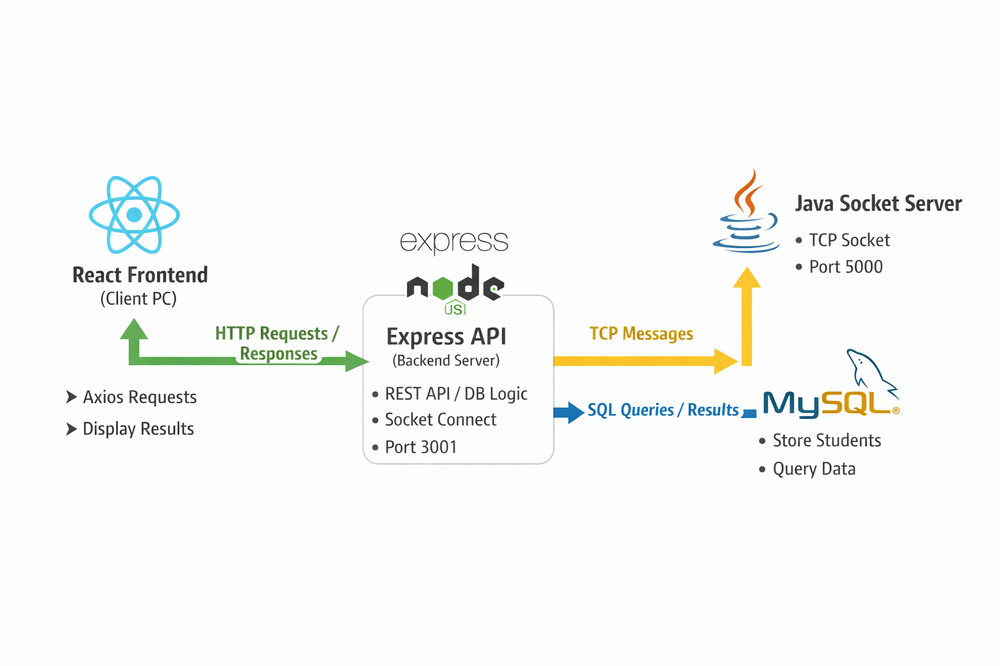
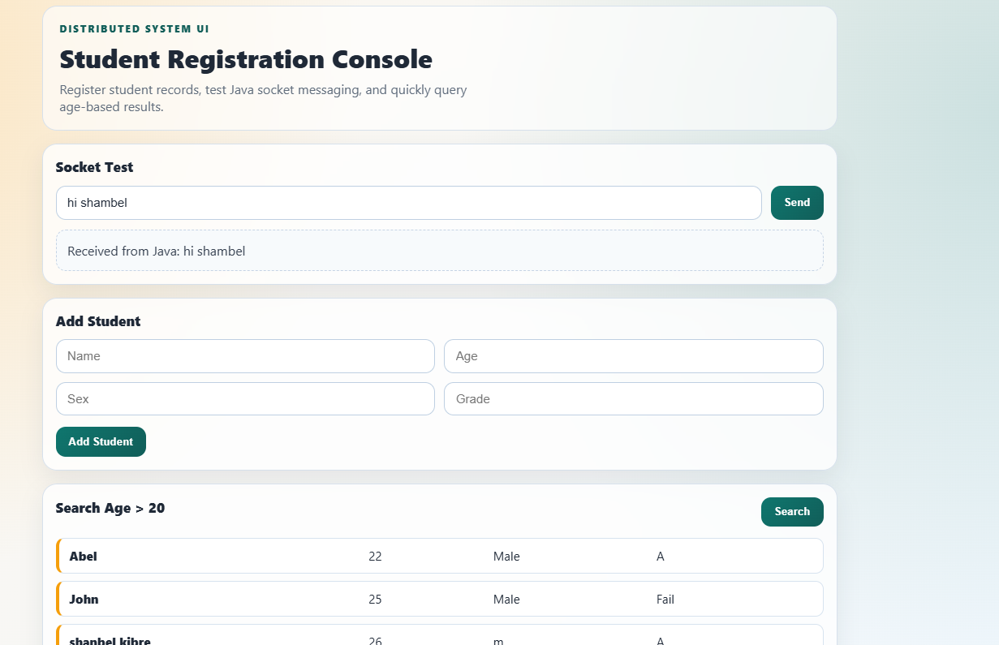

---

# Distributed GUI System (React → Express → Java Socket → MySQL)

This project demonstrates a **3-layer distributed system**:

* **React Frontend (GUI)**
* **Express.js Backend (API + DB + Java Socket communication)**
* **Java Socket Server (processing)**
* **MySQL Database (XAMPP)**

It allows:

* Sending messages from frontend → backend → Java server → backend → frontend
* Storing and querying students in a MySQL database
* Searching students by **age**, **sex**, **grade**
* Multi-environment support (.env)

---

## 📂 Project Structure

```
Distributed_GUI/
│
├── Express/           ← Node.js backend
│   ├── Node.js        ← main Express + API + Socket code
│   ├── db.js          ← MySQL connection
│   ├── package.json
│   ├── .env.development
│   └── .env.production
│
├── java_UI/           ← React frontend
│   └── src/App.jsx    ← UI + Axios calls
│
├── Server/            ← Java Socket server
│   └── G_server.java
```

---

## ⚙️ System Flow

1. React frontend sends a request via **Axios** → Express backend.
2. Express optionally forwards the request to **Java Socket Server**.
3. Java server processes and replies → Express → React UI.
4. Express also handles **MySQL database** operations (add student, search by criteria).

```
React UI
   ↓ Axios HTTP
Express API
   ↓ Socket (optional)
Java Server
   ↓
MySQL DB

```



---
# final end product image

---

